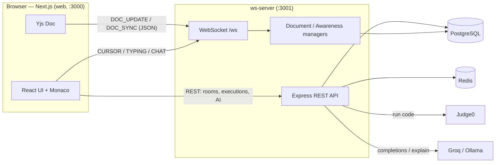

# DevCollab

Real-time collaborative code editor — a Turborepo monorepo with a Next.js frontend and a Node.js WebSocket/REST backend.

Collaborate on code in real time with **live cursors**, **shared editing** (Yjs + Monaco), **typing indicators**, **room chat**, **AI assistance**, and **instant multi-language code execution**.

---

## Features

- **Real-time collaborative editing** — Monaco Editor bound to a shared Yjs document over WebSockets.
- **Presence & awareness** — live colored cursors, member avatars, and "who's typing" indicators.
- **Room chat** — per-room messaging alongside the editor.
- **Code execution** — run JavaScript, TypeScript, Python, Java, C++, Go, and Rust (via Judge0).
- **AI assistant** — inline ghost-text completions (Ctrl/Cmd+Space) and an "Explain code" action.
- **GitHub authentication** — Auth.js (NextAuth v5) on the web, JWT-verified WebSockets on the server.
- **Polished UX** — light/dark themes, skeleton loaders, error boundaries, and mobile-friendly panels.

---

## Monorepo structure

```
devcollab/
├── apps/
│   ├── web/              # Next.js 15 (App Router) frontend
│   └── ws-server/        # Express + ws (WebSocket) + Prisma backend
├── packages/
│   └── shared-types/     # Shared TypeScript types
├── turbo.json            # Turborepo task pipeline
├── tsconfig.base.json    # Shared strict TypeScript config
└── package.json          # npm workspaces root
```

---

## Tech stack

| Area            | Technology                                                        |
| --------------- | ----------------------------------------------------------------- |
| Frontend        | Next.js 15 (App Router), React 19, TypeScript                     |
| Editor / CRDT   | Monaco Editor, Yjs, y-monaco                                      |
| Styling / UI    | Tailwind CSS v4, custom shadcn-style components, lucide-react     |
| State / data    | Zustand, TanStack React Query, Axios                              |
| Auth (web)      | Auth.js / NextAuth v5 (GitHub OAuth), `jose` for WS tokens        |
| Backend         | Node.js 20+, Express, `ws` (WebSocket), TypeScript (strict)       |
| Persistence     | PostgreSQL + Prisma, Redis                                        |
| Execution / AI  | Judge0, Groq / Ollama                                             |
| Tooling         | Turborepo, tsup, tsx, Pino                                        |

---

## Architecture



**Collaboration protocol.** The client mints a short-lived HS256 JWT (`GET /api/ws-token`) and connects to `ws://<host>/ws?token=…&roomId=…`. The server verifies the JWT, then exchanges Yjs updates as JSON messages (`JOIN_ROOM` → `DOC_SYNC`, local edits → `DOC_UPDATE`, relayed as `DOC_SYNC`). Cursors, typing, and chat flow over the same socket.

---

## Prerequisites

- **Node.js 20+** and **npm**
- **PostgreSQL** (default dev connection uses port **5433**)
- **Redis** (default `redis://localhost:6379`)
- Optional: a **Judge0** endpoint (code execution) and **Groq API key** or a local **Ollama** (AI features)
- A **GitHub OAuth app** (Authorization callback URL: `http://localhost:3000/api/auth/callback/github`)

You can start Postgres and Redis quickly with Docker:

```bash
docker run -d --name devcollab-pg -p 5433:5432 \
  -e POSTGRES_USER=devcollab -e POSTGRES_PASSWORD=devcollab -e POSTGRES_DB=devcollab postgres:16

docker run -d --name devcollab-redis -p 6379:6379 redis:7
```

---

## Getting started

```bash
# 1. Install all workspace dependencies
npm install

# 2. Configure environment
cp apps/ws-server/.env.example apps/ws-server/.env
cp apps/web/.env.example apps/web/.env.local
#   → fill in GitHub OAuth creds and a shared auth secret (see below)

# 3. Set up the database (from apps/ws-server)
cd apps/ws-server
npx prisma migrate deploy   # or: npx prisma migrate dev
npx prisma db seed          # optional sample data
cd ../..

# 4. Run everything in dev mode (web :3000, ws-server :3001)
npm run dev
```

Open http://localhost:3000.

### ⚠️ Shared auth secret (required)

The web app **signs** WebSocket tokens with `AUTH_SECRET`; the ws-server **verifies** them with `NEXTAUTH_SECRET`. **These two values must be identical**, otherwise real-time collaboration silently fails to authenticate.

Generate one and paste the same value into both files:

```bash
openssl rand -base64 32
```

- `apps/web/.env.local` → `AUTH_SECRET=…`
- `apps/ws-server/.env` → `NEXTAUTH_SECRET=…`

On startup both processes log a matching **auth secret fingerprint** (a short SHA-256 prefix). If the fingerprints differ, the secrets don't match. The ws-server refuses to start if the secret is still an example placeholder.

---

## Environment variables

### `apps/web/.env.local`

| Variable              | Required | Description                                             |
| --------------------- | -------- | ------------------------------------------------------- |
| `NEXT_PUBLIC_API_URL` | ✅       | ws-server REST base URL (e.g. `http://localhost:3001`)  |
| `NEXT_PUBLIC_WS_URL`  | ✅       | WebSocket endpoint (e.g. `ws://localhost:3001/ws`)      |
| `AUTH_SECRET`         | ✅       | Session/token secret — **must equal `NEXTAUTH_SECRET`** |
| `AUTH_URL`            | ➖       | Canonical app URL (`http://localhost:3000`)             |
| `AUTH_GITHUB_ID`      | ✅       | GitHub OAuth client id                                  |
| `AUTH_GITHUB_SECRET`  | ✅       | GitHub OAuth client secret                              |

### `apps/ws-server/.env`

| Variable                              | Required | Description                                       |
| ------------------------------------- | -------- | ------------------------------------------------- |
| `DATABASE_URL`                        | ✅       | PostgreSQL connection string                      |
| `REDIS_URL`                           | ✅       | Redis connection string                           |
| `GITHUB_CLIENT_ID` / `_SECRET`        | ✅       | GitHub OAuth credentials                          |
| `NEXTAUTH_SECRET`                     | ✅       | Token secret — **must equal web `AUTH_SECRET`**   |
| `NEXTAUTH_URL`                        | ✅       | Server base URL                                   |
| `PORT`                                | ➖       | Server port (default `3001`)                      |
| `JUDGE0_API_URL` / `JUDGE0_API_KEY`   | ✅       | Code execution backend                            |
| `GROQ_API_KEY`                        | ➖       | AI completions/explain (or use Ollama)            |
| `OLLAMA_URL`                          | ➖       | Local AI fallback (default `http://localhost:11434`) |
| `LOG_LEVEL`                           | ➖       | `debug` \| `info` \| `warn` \| `error`            |

---

## Common commands

| Command             | Description                          |
| ------------------- | ------------------------------------ |
| `npm run dev`       | Run all apps in watch mode           |
| `npm run build`     | Build all packages/apps via Turbo    |
| `npm run lint`      | Type-check the workspace             |
| `npm run typecheck` | Type-check the workspace             |
| `npm run test`      | Run tests across the workspace       |

Per-app (from the app directory): `npm run dev`, `npm run build`, `npm run start`.

---

## Deployment

The apps deploy independently.

### Frontend (`apps/web`)

Builds to a self-contained Next.js **standalone** output (`output: "standalone"`).

```bash
npm run build -w @devcollab/web
node apps/web/.next/standalone/apps/web/server.js   # or `next start`
```

Set production env vars (`NEXT_PUBLIC_API_URL`, `NEXT_PUBLIC_WS_URL`, `AUTH_SECRET`, `AUTH_URL`, GitHub creds). Deploy easily to Vercel or any Node host. Note: Monaco and its web workers are loaded via the `@monaco-editor/react` CDN loader, so the browser needs outbound internet at runtime.

### Backend (`apps/ws-server`)

```bash
npm run build -w @devcollab/ws-server
npm run start -w @devcollab/ws-server
```

Requirements in production:

- Reachable **PostgreSQL** and **Redis**.
- Run `prisma migrate deploy` before starting.
- A load balancer / proxy that supports **WebSocket upgrades** on `/ws`.
- `NEXTAUTH_SECRET` identical to the web app's `AUTH_SECRET` (verify the startup fingerprints match).

### Checklist

- [ ] `AUTH_SECRET` === `NEXTAUTH_SECRET` (fingerprints match in logs)
- [ ] GitHub OAuth callback points at the deployed web URL
- [ ] `NEXT_PUBLIC_WS_URL` uses `wss://` behind TLS
- [ ] Database migrated and reachable from the ws-server
- [ ] Judge0 / AI provider configured (or features disabled gracefully)
```
